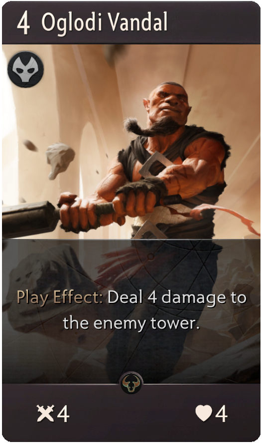

# ArtifactDock

En este archivo vamos a visualizar como recuperar datos de las cartas así como los precios de las mismas para poder realizar las distintas tareas del proyecto colectivo.

## Recuperando las cartas

Para recuperar todas las cartas tenemos que realizar un par de llamadas a 2 páginas distintas. En futuras expansiones de Artifact es posible que esas direcciones cambien por lo que tenemos que prestar atención a esto. 

### Adquirir direcciones donde hallar las cartas

Valve no deja en una ruta estática la información de todas las cartas, sino que genera una ruta dinámica cada vez que alguien hace una petición de las mismas, para ver cuales son las rutas generadas debemos visitar las dos direcciones que se muestran a continuación. 

```
https://playartifact.com/cardset/00/
```
```
https://playartifact.com/cardset/01/
```

Estas dos direcciones mostrarán una respuesta de tipo JSON en la cual tendremos que concatenar dos campos de las mismas para poder consultar el montante de cartas total de Artifact. La respuesta será algo parecido a esto.

```json
{"cdn_root":"https:\/\/steamcdn-a.akamaihd.net\/","url":"\/apps\/583950\/resource\/card_set_1.1C449086BE56DAD0BB7E7227B6396EA4BE7BF553.json","expire_time":1543836947}
```
En este JSON tenemos que concatenar las cadenas de texto ofrecidas en el campo `cdn_root` y `url`.


### Descifrando las RESPONSES

Una vez hemos concatenado esas cadenas haremos una petición GET a las mismas, la cual nos devolverá una gran array JSON de la que extraeremos toda la información necesaria de cada una de las cartas, el segundo enlace generado es el que tiene la mayor parte de información y cartas referentes a la expansión en activo, en este caso es la versión vanilla de Artifact, llamada CALL TO ARMS, como podemos ver en la response. 

```json
{
"card_set":{
"version":1,
"set_info":{
"set_id":1,
"pack_item_def":1000,
"name":{
"english":"Call to Arms",
"german":"Ruf zu den Waffen",
"french":"Appel aux armes",
"italian":"Chiamata alle armi",
"koreana":"전장의 부름",
"spanish":"Llamamiento a las armas",
"schinese":"武装号召",
"tchinese":"武裝號召",
"russian":"Зов битвы",
"thai":"Call to Arms",
"japanese":"戦闘準備",
"portuguese":"Call to Arms",
"polish":"Call to Arms",
"danish":"Call to Arms",
"dutch":"Call to Arms",
"finnish":"Call to Arms",
"norwegian":"Call to Arms",
"swedish":"Call to Arms",
"hungarian":"Call to Arms",
"czech":"Call to Arms",
"romanian":"Call to Arms",
"turkish":"Call to Arms",
"brazilian":"Convocação de Guerra",
"bulgarian":"Call to Arms",
"greek":"Call to Arms",
"ukrainian":"Call to Arms",
"latam":"Llamamiento a las armas",
"vietnamese":"Call to Arms"
}
},
"card_list":[
{
    ...
}
]
```

Una de las grandes ventajas es que tendremos información de las cartas en todos los idiomas, por lo que podriamos tener una aplicación poliglota desde el comienzo, sin un especial calentamiento de cabeza.

## Tipos de cartas

En el este punto vamos a analizar los distintos tipos de cartas que encontramos en Artifact, que están en el campo `card_list` del JSON que recuperamos anteriormente. 

### Heroes

En el caso de los heroes nos encontramos con unas cartas que llevan asociadas 3 cartas iguales de distinto tipo, estas cartas van irremediablemente asocias con ese y solo ese heroe, y no pueden ser seleccionadas si no se coge al heroe determinado. Y no solo eso sino que en algunos casos el Heroe puede contener una habilidad de tipo activa o pasiva que forma parte de la `card_list` pero que no son cartas en si mismas, una excepción a esto es el heroe `Axe` que no cuenta con nínguna pasiva.

Para entender mejor este tipo de cartas vamos a coger una como ejemplo.


Kanna es una carta de heroe azul, cada carta cuenta con un color de 4 posibles (azul, negro rojo, verde). Solo los objetos, que explicaremos mas adelante, no tienen ningún color. Una vez visto lo que vamos a hacer es ver el JSON object de la carta de kanna.
```json
{
"card_id":10031,
"base_card_id":10031,
"card_type":"Hero",
"card_name":{
"english":"Kanna",
"german":"Kanna",
"french":"Kanna",
"italian":"Kanna",
"koreana":"칸나",
"spanish":"Kanna",
"schinese":"卡娜",
"tchinese":"卡娜",
"russian":"Канна",
"thai":"Kanna",
"japanese":"カンナ",
"portuguese":"Kanna",
"polish":"Kanna",
"danish":"Kanna",
"dutch":"Kanna",
"finnish":"Kanna",
"norwegian":"Kanna",
"swedish":"Kanna",
"hungarian":"Kanna",
"czech":"Kanna",
"romanian":"Kanna",
"turkish":"Kanna",
"brazilian":"Kanna",
"bulgarian":"Kanna",
"greek":"Kanna",
"ukrainian":"Kanna",
"latam":"Kanna",
"vietnamese":"Kanna"
},
"card_text":{
"english":"<span style='font-weight:bold;color:#ffffff;'>Bringer of Conquest</span><br/>The random allied <span style='font-weight:bold;color:#ffffff;'>Melee Creeps</span> are deployed into Kanna's lane.",
"german":"<span style='font-weight:bold;color:#ffffff;'>Bote der Eroberung</span><br/>Die zufälligen verbündeten <span style='font-weight:bold;color:#ffffff;'>Nahkampfdiener</span> werden auf Kannas Pfad eingesetzt.",
"french":"<span style='font-weight:bold;color:#ffffff;'>Main-forte</span><br/>Les <span style='font-weight:bold;color:#ffffff;'>cryptides de mêlée</span> alliés sont déployés dans la zone de Kanna.",
"italian":"<span style='font-weight:bold;color:#ffffff;'>Conquista</span><br/>I <span style='font-weight:bold;color:#ffffff;'>Creep da mischia</span> casuali alleati sono schierati nella corsia di Kanna.",
"koreana":"<span style='font-weight:bold;color:#ffffff;'>정복의 인도자</span><br/>아군 <span style='font-weight:bold;color:#ffffff;'>근접 크립</span>이 무작위로 선정되어 칸나의 전선에 배치됩니다.",
"spanish":"<span style='font-weight:bold;color:#ffffff;'>Conquistadora</span><br/>Los <span style='font-weight:bold;color:#ffffff;'>críptidos de melé</span> aliados aleatorios se despliegan en la senda de Kanna.",
"schinese":"<span style='font-weight:bold;color:#ffffff;'>征服使者</span><br/>将随机友方<span style='font-weight:bold;color:#ffffff;'>近战小兵</span>部署至卡娜的兵线。",
"tchinese":"<span style='font-weight:bold;color:#ffffff;'>征服使者</span><br/>將隨機友方<span style='font-weight:bold;color:#ffffff;'>近戰小兵</span>部署至卡娜的兵線。",
"russian":"<span style='font-weight:bold;color:#ffffff;'>Вестница завоевания</span><br/>В фазу размещения случайные союзные <span style='font-weight:bold;color:#ffffff;'>крипы-мечники</span> появляются на линии <span style='font-weight:bold;color:#ffffff;'>Канны</span>.",
"thai":"<span style='font-weight:bold;color:#ffffff;'>Bringer of Conquest</span><br/>The random allied <span style='font-weight:bold;color:#ffffff;'>Melee Creeps</span> are deployed into Kanna's lane.",
"japanese":"<span style='font-weight:bold;color:#ffffff;'>征服の導き手</span><br/>毎ターンのランダムな味方<span style='font-weight:bold;color:#ffffff;'>近接クリープ</span>は、カンナのレーンに配置される。",
"portuguese":"<span style='font-weight:bold;color:#ffffff;'>Bringer of Conquest</span><br/>The random allied <span style='font-weight:bold;color:#ffffff;'>Melee Creeps</span> are deployed into Kanna's lane.",
"polish":"<span style='font-weight:bold;color:#ffffff;'>Bringer of Conquest</span><br/>The random allied <span style='font-weight:bold;color:#ffffff;'>Melee Creeps</span> are deployed into Kanna's lane.",
"danish":"<span style='font-weight:bold;color:#ffffff;'>Bringer of Conquest</span><br/>The random allied <span style='font-weight:bold;color:#ffffff;'>Melee Creeps</span> are deployed into Kanna's lane.",
"dutch":"<span style='font-weight:bold;color:#ffffff;'>Bringer of Conquest</span><br/>The random allied <span style='font-weight:bold;color:#ffffff;'>Melee Creeps</span> are deployed into Kanna's lane.",
"finnish":"<span style='font-weight:bold;color:#ffffff;'>Bringer of Conquest</span><br/>The random allied <span style='font-weight:bold;color:#ffffff;'>Melee Creeps</span> are deployed into Kanna's lane.",
"norwegian":"<span style='font-weight:bold;color:#ffffff;'>Bringer of Conquest</span><br/>The random allied <span style='font-weight:bold;color:#ffffff;'>Melee Creeps</span> are deployed into Kanna's lane.",
"swedish":"<span style='font-weight:bold;color:#ffffff;'>Bringer of Conquest</span><br/>The random allied <span style='font-weight:bold;color:#ffffff;'>Melee Creeps</span> are deployed into Kanna's lane.",
"hungarian":"<span style='font-weight:bold;color:#ffffff;'>Bringer of Conquest</span><br/>The random allied <span style='font-weight:bold;color:#ffffff;'>Melee Creeps</span> are deployed into Kanna's lane.",
"czech":"<span style='font-weight:bold;color:#ffffff;'>Bringer of Conquest</span><br/>The random allied <span style='font-weight:bold;color:#ffffff;'>Melee Creeps</span> are deployed into Kanna's lane.",
"romanian":"<span style='font-weight:bold;color:#ffffff;'>Bringer of Conquest</span><br/>The random allied <span style='font-weight:bold;color:#ffffff;'>Melee Creeps</span> are deployed into Kanna's lane.",
"turkish":"<span style='font-weight:bold;color:#ffffff;'>Bringer of Conquest</span><br/>The random allied <span style='font-weight:bold;color:#ffffff;'>Melee Creeps</span> are deployed into Kanna's lane.",
"brazilian":"<span style='font-weight:bold;color:#ffffff;'>Agente da Conquista</span><br/>As <span style='font-weight:bold;color:#ffffff;'>Criaturas Guerreiras</span> aliadas aleatórias são posicionadas na trilha de Kanna.",
"bulgarian":"<span style='font-weight:bold;color:#ffffff;'>Bringer of Conquest</span><br/>The random allied <span style='font-weight:bold;color:#ffffff;'>Melee Creeps</span> are deployed into Kanna's lane.",
"greek":"<span style='font-weight:bold;color:#ffffff;'>Bringer of Conquest</span><br/>The random allied <span style='font-weight:bold;color:#ffffff;'>Melee Creeps</span> are deployed into Kanna's lane.",
"ukrainian":"<span style='font-weight:bold;color:#ffffff;'>Bringer of Conquest</span><br/>The random allied <span style='font-weight:bold;color:#ffffff;'>Melee Creeps</span> are deployed into Kanna's lane.",
"latam":"<span style='font-weight:bold;color:#ffffff;'>Conquistadora</span><br/>Los <span style='font-weight:bold;color:#ffffff;'>críptidos cuerpo a cuerpo</span> aliados aleatorios se despliegan en la senda de Kanna.",
"vietnamese":"<span style='font-weight:bold;color:#ffffff;'>Bringer of Conquest</span><br/>The random allied <span style='font-weight:bold;color:#ffffff;'>Melee Creeps</span> are deployed into Kanna's lane."
},
"mini_image":{
"default":"https://steamcdn-a.akamaihd.net/apps/583950/icons/set01/10031.967b53755c3a477cc89b05422018a06d08e837f2.png"
},
"large_image":{
"default":"https://steamcdn-a.akamaihd.net/apps/583950/icons/set01/10031_large_english.3948113eb732a4f4eb83d3b1f907377dca1eb3c6.png",
"german":"https://steamcdn-a.akamaihd.net/apps/583950/icons/set01/10031_large_german.966b1ae54fc55a9ed4dc49fa249f8160d63f44ca.png",
"french":"https://steamcdn-a.akamaihd.net/apps/583950/icons/set01/10031_large_french.6b355ccc5738d11d49b3f83b09de93aa82fbc020.png",
"italian":"https://steamcdn-a.akamaihd.net/apps/583950/icons/set01/10031_large_italian.6b355ccc5738d11d49b3f83b09de93aa82fbc020.png",
"koreana":"https://steamcdn-a.akamaihd.net/apps/583950/icons/set01/10031_large_koreana.c77333c25a8225f6f7e546b0a86b8cb01c90c533.png",
"spanish":"https://steamcdn-a.akamaihd.net/apps/583950/icons/set01/10031_large_spanish.966b1ae54fc55a9ed4dc49fa249f8160d63f44ca.png",
"schinese":"https://steamcdn-a.akamaihd.net/apps/583950/icons/set01/10031_large_schinese.16a02e4c15e7f400518f7e2524b0d600ba3777ca.png",
"tchinese":"https://steamcdn-a.akamaihd.net/apps/583950/icons/set01/10031_large_tchinese.92a0d49728b8e468da595769a0b784a6918248ae.png",
"russian":"https://steamcdn-a.akamaihd.net/apps/583950/icons/set01/10031_large_russian.417fe2046267cbbcd3dc9571c2ae339d8507137a.png",
"japanese":"https://steamcdn-a.akamaihd.net/apps/583950/icons/set01/10031_large_japanese.476f7ea26c3a11cfc777489b320ac1cd73a175a1.png",
"brazilian":"https://steamcdn-a.akamaihd.net/apps/583950/icons/set01/10031_large_brazilian.966b1ae54fc55a9ed4dc49fa249f8160d63f44ca.png",
"latam":"https://steamcdn-a.akamaihd.net/apps/583950/icons/set01/10031_large_latam.966b1ae54fc55a9ed4dc49fa249f8160d63f44ca.png"
},
"ingame_image":{
"default":"https://steamcdn-a.akamaihd.net/apps/583950/icons/set01/10031_ingame.f73eb3453e6882b39142225ac45c2ea7a1686044.png"
},
"illustrator":"Scott M Fischer",
"rarity":"Rare",
"is_blue":true,
"item_def":110031,
"attack":2,
"hit_points":12,
"references":[
{
"card_id":10325,
"ref_type":"includes",
"count":3
},
{
"card_id":10503,
"ref_type":"passive_ability"
}
]

}
```
Analizando el JSON, vemos una serie de cosas interesantes:

1. Lo primero a parte del `card_id` es el `card_type` este campo denota el tipo de carta, en este caso `Hero`.
2. También podemos ver que contamos con distintos campos que están en multilenguaje, como el texto de la carta, la imagen, etc.
3. El caso de los heroes al contrario que el resto de cartas cuentan con una `mini_image` y con una `ingame_image`, estos campos con exclusivos de los heroes, y son pequeños iconos de los mismos.
4. `rarity` muestra la rareza de la carta, las cartas pueden ser `Common`, `Uncommon` y `Rare`.
5. La propiedad `is_blue` denota que esta carta es de tipo azul, en el caso de que fuese de otro color, contaría con el campo `is_black`, `is_green`, `is_red` respectivamente.
6. `item_def` es una id que utilizaremos a posteriori para buscar la cotización de la carta en el marketplace.
7. Los campos `attack`, `hit_points` y `armor`(en caso de que tenga armadura), muestran el ataque, la vida y la armadura de la carta.
8. Por ultimo en `references` contamos con las "cartas" relacionadas con este heroe, en etste caso contamos con dos.
   * Por un lado la primera en la que encontramos un campo `count` y `ref_type: includes` lo cual nos hace saber que la carta asociada es una de las que he comentado antes que iba ligada al heroe.
   * Y la otra, que como vemos es una `passive_ability` que indica la habilidad del heroe, por lo que sabemos que aunque se trate como tal, esto no es una carta propiamente dicha. Las habilidades de los heroes solo pueden ser de dos tipos `passive_ability` y `active_ability`.

Puede ser algo complejo entender este tipo de cartas, pero no dudeis en preguntar si hay algo que no entendáis.


### Items

Los items cuentan con la particularidad de que son la única carta del juego que cuestan cierta cantidad de gold denostada en la propiedad `gold_cost`, y a la vez no cuentan con ningún color.


```json
{
"card_id":10203,
"base_card_id":10203,
"card_type":"Item",
"card_name":{
"english":"Phase Boots",
"german":"Phasenstiefel",
"french":"Bottes d'infiltration",
"italian":"Stivali della fase",
"koreana":"위상변화 장화",
"spanish":"Botas de fase",
"schinese":"相位鞋",
"tchinese":"相位靴",
"russian":"Сапоги смещения",
"thai":"Phase Boots",
"japanese":"フェイズブーツ",
"portuguese":"Phase Boots",
"polish":"Phase Boots",
"danish":"Phase Boots",
"dutch":"Phase Boots",
"finnish":"Phase Boots",
"norwegian":"Phase Boots",
"swedish":"Phase Boots",
"hungarian":"Phase Boots",
"czech":"Phase Boots",
"romanian":"Phase Boots",
"turkish":"Phase Boots",
"brazilian":"Botas de Fase",
"bulgarian":"Phase Boots",
"greek":"Phase Boots",
"ukrainian":"Phase Boots",
"latam":"Botas de fase",
"vietnamese":"Phase Boots"
},
"card_text":{
"english":"Equipped hero has +4 Health.<BR/>\n<BR/>\n<span style='font-weight:bold;color:#ffffff;'>Active 2:</span> Swap equipped hero with another ally.",
"german":"Der ausgerüstete Held hat +4 Lebenspunkte.<BR>\n<BR>\n<span style='font-weight:bold;color:#ffffff;'>Aktiv 2:</span> Tausche den ausgerüsteten Helden mit einem anderen Verbündeten.",
"french":"Le héros équipé a +4 PV.<BR>\n<BR>\n<span style='font-weight:bold;color:#ffffff;'>Active 2 :</span> permutez le héros équipé avec un autre allié.",
"italian":"L'eroe equipaggiato ottiene +4 punti salute.<BR/>\n<BR/>\n<span style='font-weight:bold;color:#ffffff;'>Attiva 2:</span> Scambia la posizione di un eroe equipaggiato con quella di un altro alleato.",
"koreana":"장착한 영웅의 체력이 4 증가합니다.<BR/>\n<BR/>\n<span style='font-weight:bold;color:#ffffff;'>활성화 2:</span> 장착한 영웅을 다른 아군 하나와 교체합니다.",
"spanish":"El héroe equipado recibe +4 de Vida.<BR/>\n<BR/>\n<span style='font-weight:bold;color:#ffffff;'>Activa 2:</span> Cambia al héroe equipado con un aliado.",
"schinese":"装备此物品的英雄+4生命 。<BR/>\n<BR/>\n<span style='font-weight:bold;color:#ffffff;'>主动2：</span>将装备此物品的英雄与另一个友方单位互换位置。",
"tchinese":"裝備此物品的英雄+4生命。<BR>\n<BR>\n<span style='font-weight:bold;color:#ffffff;'>主動2：</span>將裝備此物品的英雄與另一個友方單位互換。",
"russian":"Даёт владельцу +4&#160;к&#160;здоровью.<BR>\n<BR>\n<span style='font-weight:bold;color:#ffffff;'>Активная 2:</span> меняет владельца местами с&#160;выбранным союзником.",
"thai":"Equipped hero has +4 Health.<BR/>\n<BR/>\n<span style='font-weight:bold;color:#ffffff;'>Active 2:</span> Swap equipped hero with another ally.",
"japanese":"装備したヒーローは＋4ヘルスを得る。<BR>\n<BR>\n<span style='font-weight:bold;color:#ffffff;'>アクティブ2:</span>装備したヒーローを他の味方と入れ替える。",
"portuguese":"Equipped hero has +4 Health.<BR/>\n<BR/>\n<span style='font-weight:bold;color:#ffffff;'>Active 2:</span> Swap equipped hero with another ally.",
"polish":"Equipped hero has +4 Health.<BR/>\n<BR/>\n<span style='font-weight:bold;color:#ffffff;'>Active 2:</span> Swap equipped hero with another ally.",
"danish":"Equipped hero has +4 Health.<BR/>\n<BR/>\n<span style='font-weight:bold;color:#ffffff;'>Active 2:</span> Swap equipped hero with another ally.",
"dutch":"Equipped hero has +4 Health.<BR/>\n<BR/>\n<span style='font-weight:bold;color:#ffffff;'>Active 2:</span> Swap equipped hero with another ally.",
"finnish":"Equipped hero has +4 Health.<BR/>\n<BR/>\n<span style='font-weight:bold;color:#ffffff;'>Active 2:</span> Swap equipped hero with another ally.",
"norwegian":"Equipped hero has +4 Health.<BR/>\n<BR/>\n<span style='font-weight:bold;color:#ffffff;'>Active 2:</span> Swap equipped hero with another ally.",
"swedish":"Equipped hero has +4 Health.<BR/>\n<BR/>\n<span style='font-weight:bold;color:#ffffff;'>Active 2:</span> Swap equipped hero with another ally.",
"hungarian":"Equipped hero has +4 Health.<BR/>\n<BR/>\n<span style='font-weight:bold;color:#ffffff;'>Active 2:</span> Swap equipped hero with another ally.",
"czech":"Equipped hero has +4 Health.<BR/>\n<BR/>\n<span style='font-weight:bold;color:#ffffff;'>Active 2:</span> Swap equipped hero with another ally.",
"romanian":"Equipped hero has +4 Health.<BR/>\n<BR/>\n<span style='font-weight:bold;color:#ffffff;'>Active 2:</span> Swap equipped hero with another ally.",
"turkish":"Equipped hero has +4 Health.<BR/>\n<BR/>\n<span style='font-weight:bold;color:#ffffff;'>Active 2:</span> Swap equipped hero with another ally.",
"brazilian":"Ao equipar, o herói ganha +4 de Vida.<BR/>\n<BR/>\n<span style='font-weight:bold;color:#ffffff;'>Ativa2:</span> Troque este herói de lugar com um aliado.",
"bulgarian":"Equipped hero has +4 Health.<BR/>\n<BR/>\n<span style='font-weight:bold;color:#ffffff;'>Active 2:</span> Swap equipped hero with another ally.",
"greek":"Equipped hero has +4 Health.<BR/>\n<BR/>\n<span style='font-weight:bold;color:#ffffff;'>Active 2:</span> Swap equipped hero with another ally.",
"ukrainian":"Equipped hero has +4 Health.<BR/>\n<BR/>\n<span style='font-weight:bold;color:#ffffff;'>Active 2:</span> Swap equipped hero with another ally.",
"latam":"Otorga +4 de vida al héroe equipado..<BR/>\n<BR/>\n<span style='font-weight:bold;color:#ffffff;'>Activa 2:</span> intercambia al héroe equipado con otro aliado.",
"vietnamese":"Equipped hero has +4 Health.<BR/>\n<BR/>\n<span style='font-weight:bold;color:#ffffff;'>Active 2:</span> Swap equipped hero with another ally."
},
"mini_image":{
"default":"https://steamcdn-a.akamaihd.net/apps/583950/icons/set01/10203.d2a4fa3d2d7e42fd4af22b3f0b622ef53648f728.png"
},
"large_image":{
"default":"https://steamcdn-a.akamaihd.net/apps/583950/icons/set01/10203_large_english.05c29b9ae241932caf670057f6791268f46e63eb.png",
"german":"https://steamcdn-a.akamaihd.net/apps/583950/icons/set01/10203_large_german.67a39234b9035d4c27baa15e940de75162f1f5bb.png",
"french":"https://steamcdn-a.akamaihd.net/apps/583950/icons/set01/10203_large_french.2cc0a0047698b0327744df7bdbe70f7eb9cf3757.png",
"italian":"https://steamcdn-a.akamaihd.net/apps/583950/icons/set01/10203_large_italian.1de9e6f0e283f8ccb9838e3bcb65209a66b1c294.png",
"koreana":"https://steamcdn-a.akamaihd.net/apps/583950/icons/set01/10203_large_koreana.82b8623423c23b33f9d6d4d2a548493befb37bcb.png",
"spanish":"https://steamcdn-a.akamaihd.net/apps/583950/icons/set01/10203_large_spanish.268b1ab6b72db51f60a6a1a79a86fd9ba8886f1b.png",
"schinese":"https://steamcdn-a.akamaihd.net/apps/583950/icons/set01/10203_large_schinese.4e5ac2629b30bfb239f834b56ba382672c6af161.png",
"tchinese":"https://steamcdn-a.akamaihd.net/apps/583950/icons/set01/10203_large_tchinese.17d39f5bdc08e13634c46158c7ee17a915aea617.png",
"russian":"https://steamcdn-a.akamaihd.net/apps/583950/icons/set01/10203_large_russian.a3127512ab0a147f18eaff84c96fa2082d43f313.png",
"japanese":"https://steamcdn-a.akamaihd.net/apps/583950/icons/set01/10203_large_japanese.23aec437d5f70c81b6a7a0e05d418e2862c62f06.png",
"brazilian":"https://steamcdn-a.akamaihd.net/apps/583950/icons/set01/10203_large_brazilian.5e835b2e2ed482218b1a1e43fa0297239e3e0f81.png",
"latam":"https://steamcdn-a.akamaihd.net/apps/583950/icons/set01/10203_large_latam.2e58a8754a2625adb679d826c1199165c6fd2143.png"
},
"ingame_image":{

},
"illustrator":"Pauline Voss",
"rarity":"Uncommon",
"sub_type":"Accessory",
"gold_cost":6,
"item_def":110203,
"references":[
{
"card_id":10470,
"ref_type":"active_ability"
}
]

}
```

### Otras

Al igual que los heroes, el resto de cartas también puede tener otras "cartas" asociadas, me refiero a habilidades pasivas o activas relacionadas con las mismas, y corresponden a un color determinado.

Entre los distintos tipos de cartas que nos podemos encontrar contamos con:

1. `Improvement`.
2. `Spell`.
3. `Creep`, estas criaturas al igual que los heroes pueden contar con `attack`, `hit_points` y `armor`.

Todas ellas cuentan con un campo llamado `mana_cost` que indica cuanto maná cuesta jugarlas, en el caso de los `Improvement` y `Spell` puede darse el caso que que cuente con una propiedad llamada `is_crosslane`, en el caso de que exista esta propiedad tendra ciertos efectos directos sobre el juego que ahora mismo no nos interesan.



```json
{
"card_id":10092,
"base_card_id":10092,
"card_type":"Creep",
"card_name":{
"english":"Oglodi Vandal",
"german":"Oglodi-Vandale",
"french":"Vandale oglodi",
"italian":"Vandalo Oglodi",
"koreana":"오글로디 훼손자",
"spanish":"Vándalo Oglodi",
"schinese":"高地人破坏者",
"tchinese":"歐格羅迪破壞者",
"russian":"Оглоди-вандал",
"thai":"Oglodi Vandal",
"japanese":"オグローディの破壊屋",
"portuguese":"Oglodi Vandal",
"polish":"Oglodi Vandal",
"danish":"Oglodi Vandal",
"dutch":"Oglodi Vandal",
"finnish":"Oglodi Vandal",
"norwegian":"Oglodi Vandal",
"swedish":"Oglodi Vandal",
"hungarian":"Oglodi Vandal",
"czech":"Oglodi Vandal",
"romanian":"Oglodi Vandal",
"turkish":"Oglodi Vandal",
"brazilian":"Vândalo Oglodi",
"bulgarian":"Oglodi Vandal",
"greek":"Oglodi Vandal",
"ukrainian":"Oglodi Vandal",
"latam":"Vándalo Oglodi",
"vietnamese":"Oglodi Vandal"
},
"card_text":{
"english":"<span style='font-weight:bold;color:#ffffff;'>Play Effect:</span>  Deal 4 damage to the enemy tower.",
"german":"<span style='font-weight:bold;color:#ffffff;'>Ausspieleffekt:</span> Füge dem gegnerischen Turm 4 Schaden zu.",
"french":"<span style='font-weight:bold;color:#ffffff;'>Effet immédiat :</span> inflige 4 points de dégâts à la tour ennemie.",
"italian":"<span style='font-weight:bold;color:#ffffff;'>Effetto di gioco:</span> Infliggi 4 punti danno alla torre nemica.",
"koreana":"<span style='font-weight:bold;color:#ffffff;'>플레이 효과:</span>  적 포탑에 피해를 4 줍니다.",
"spanish":"<span style='font-weight:bold;color:#ffffff;'>Efecto de juego:</span> inflige 4 de daño a una torre enemiga.",
"schinese":"<span style='font-weight:bold;color:#ffffff;'>出牌效果：</span>对敌方塔造成4伤害。",
"tchinese":"<span style='font-weight:bold;color:#ffffff;'>出牌效果：</span>對敵方塔造成4傷害。",
"russian":"<span style='font-weight:bold;color:#ffffff;'>Эффект разыгрывания:</span> наносит 4 урона вражеской башне.",
"thai":"<span style='font-weight:bold;color:#ffffff;'>Play Effect:</span>  Deal 4 damage to the enemy tower.",
"japanese":"<span style='font-weight:bold;color:#ffffff;'>プレイ時効果:</span>敵タワーに4ダメージを与える。",
"portuguese":"<span style='font-weight:bold;color:#ffffff;'>Play Effect:</span>  Deal 4 damage to the enemy tower.",
"polish":"<span style='font-weight:bold;color:#ffffff;'>Play Effect:</span>  Deal 4 damage to the enemy tower.",
"danish":"<span style='font-weight:bold;color:#ffffff;'>Play Effect:</span>  Deal 4 damage to the enemy tower.",
"dutch":"<span style='font-weight:bold;color:#ffffff;'>Play Effect:</span>  Deal 4 damage to the enemy tower.",
"finnish":"<span style='font-weight:bold;color:#ffffff;'>Play Effect:</span>  Deal 4 damage to the enemy tower.",
"norwegian":"<span style='font-weight:bold;color:#ffffff;'>Play Effect:</span>  Deal 4 damage to the enemy tower.",
"swedish":"<span style='font-weight:bold;color:#ffffff;'>Play Effect:</span>  Deal 4 damage to the enemy tower.",
"hungarian":"<span style='font-weight:bold;color:#ffffff;'>Play Effect:</span>  Deal 4 damage to the enemy tower.",
"czech":"<span style='font-weight:bold;color:#ffffff;'>Play Effect:</span>  Deal 4 damage to the enemy tower.",
"romanian":"<span style='font-weight:bold;color:#ffffff;'>Play Effect:</span>  Deal 4 damage to the enemy tower.",
"turkish":"<span style='font-weight:bold;color:#ffffff;'>Play Effect:</span>  Deal 4 damage to the enemy tower.",
"brazilian":"<span style='font-weight:bold;color:#ffffff;'>Efeito ao jogar:</span>  Cause 4 de dano à torre inimiga.",
"bulgarian":"<span style='font-weight:bold;color:#ffffff;'>Play Effect:</span>  Deal 4 damage to the enemy tower.",
"greek":"<span style='font-weight:bold;color:#ffffff;'>Play Effect:</span>  Deal 4 damage to the enemy tower.",
"ukrainian":"<span style='font-weight:bold;color:#ffffff;'>Play Effect:</span>  Deal 4 damage to the enemy tower.",
"latam":"<span style='font-weight:bold;color:#ffffff;'>Efecto de juego:</span> inflige 4 de daño a una torre enemiga.",
"vietnamese":"<span style='font-weight:bold;color:#ffffff;'>Play Effect:</span>  Deal 4 damage to the enemy tower."
},
"mini_image":{
"default":"https://steamcdn-a.akamaihd.net/apps/583950/icons/set01/10092.8c1d0f80d2a8a666a2f882f0a50379d547d9ae29.png"
},
"large_image":{
"default":"https://steamcdn-a.akamaihd.net/apps/583950/icons/set01/10092_large_english.24c49023438ae1376f40cc5116a2b2e8d1f18c46.png",
"german":"https://steamcdn-a.akamaihd.net/apps/583950/icons/set01/10092_large_german.b034b73d1a67d51e3c5048bc43891dd6ea2376e0.png",
"french":"https://steamcdn-a.akamaihd.net/apps/583950/icons/set01/10092_large_french.26c84eeab05a515bc5d819c28ca5c3d74bf9e4aa.png",
"italian":"https://steamcdn-a.akamaihd.net/apps/583950/icons/set01/10092_large_italian.db4e8666c9d925b6c03dc749f4116dac79ebe5f1.png",
"koreana":"https://steamcdn-a.akamaihd.net/apps/583950/icons/set01/10092_large_koreana.7e28ecfe3ed5a8f97cf13e53b11c04ba412bbc0b.png",
"spanish":"https://steamcdn-a.akamaihd.net/apps/583950/icons/set01/10092_large_spanish.48a42bf653aaafb12c8fd2675cceb8096fdcf69b.png",
"schinese":"https://steamcdn-a.akamaihd.net/apps/583950/icons/set01/10092_large_schinese.f8923bfc14a6813a53fdcb138d458f85f61d9343.png",
"tchinese":"https://steamcdn-a.akamaihd.net/apps/583950/icons/set01/10092_large_tchinese.d4d75c556f02c27403032eda6f0addee7099c82a.png",
"russian":"https://steamcdn-a.akamaihd.net/apps/583950/icons/set01/10092_large_russian.9a5503a38813c2f84f384077b932e3e8de91d788.png",
"japanese":"https://steamcdn-a.akamaihd.net/apps/583950/icons/set01/10092_large_japanese.f79439f94cd7cefaa7f70cfed2bf7df2a6a9aa58.png",
"brazilian":"https://steamcdn-a.akamaihd.net/apps/583950/icons/set01/10092_large_brazilian.56bf6d6b7ab84ca9daf23d1c9e7bf001b1dc07ec.png",
"latam":"https://steamcdn-a.akamaihd.net/apps/583950/icons/set01/10092_large_latam.48a42bf653aaafb12c8fd2675cceb8096fdcf69b.png"
},
"ingame_image":{

},
"illustrator":"JiHun Lee",
"rarity":"Common",
"is_black":true,
"mana_cost":4,
"item_def":110092,
"attack":4,
"hit_points":4,
"references":[

]

}
```


## Que nos interesa

Dado que nuestra aplicación se va a centrar en ver los precios de las cartas vamos a limitar los tipos de cartas con los que vamos a trabajar y ver con que campos nos vamos a quedar.

En cuanto a tipos de cartas, solo vamos a coger las siguientes:
1. `Hero`
2. `Item`
3. `Spell`
4. `Improvement`

> Una manera rápida, sencilla y para toda la família de filtrar estas cartas es que cuando recorramos la `card_list` del JSON object, solo nos quedemos con las cartas que cuenten con el campo `item_def`.

A parte de coger solo esaos tipos de cartas, nos vamos a quedar tan solo con los siguientes campos:
1. `card_id`
2. `card_type`
3. `card_name`, con default como principal, ya veremos para que utilizaremos los demas.
4. `large_image`, default como principal.
5. `illustrator`
6. `rarity`
7. `item_def`

## Marketplace

VALVE en su plataforma STEAM, nos ofrece la posibilidad de comprar y vender nuestras cartas, en el proyecto vamos a intentar ver cuales son los precios de todas y cada una de las cartas y calcular un coste total si tuviesemos que comprarlas todas, a continuación os explico como encontrar el precio de una carta actual(cambia cada 5sec) y poder vel el precio medio que la carta a tenido los últimos meses.

## Contributing


## Versioning


## Authors

* **Manel Mena** - *Initial work* - [manelme.com](https://manelme.com/)

See also the list of [contributors](https://github.com/your/project/contributors) who participated in this project.

## License

This project is licensed under the MIT License - see the [LICENSE.md](LICENSE.md) file for details

## Acknowledgments

* Hat tip to anyone whose code was used
* Inspiration
* etc