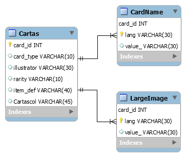

# Artifact DRA19

_Backend de nuestra aplicación que nutritá al front de los datos y las operaciones necesarias para la finaliad del proyecto_

## Comenzando 🚀

_Estas instrucciones te permitirán obtener una copia del proyecto en funcionamiento en tu máquina local para propósitos de desarrollo y pruebas._

_Nuestro backend se compone simplemente de una API con metodos CRUD para el manejo de las jugadas y las cartas:_

## Diagrama de la base de datos
----

----

## Métodos de la API

* **URL**

  [/cartas] - Devuelve todos los aditivos

* **Method:**

  `GET`

### Pre-requisitos 📋

_Tener instalado DOCKER en tu máquina_

### Instalación 🔧

_Para lanzar el backend necesitas ejecutar los siguientes comandos (situandote en la raíz del backend)_

_Construir el contenedor_

```
docker-compose build
```

_Levantar el contenedor_

```
docker-compose up
```

_El siguiente paso podemos comprobar que los contenedores se han levantado adecuadamente:_

```
docker ps
```

_Como ultimo paso tendremos que ejecutar el SCRIPT en nuestra BD para la creación de la estructura de la BD_

```
Notocar.sql
```

## Ejecutando las pruebas ⚙️

_Podremos ir a Postman mismamente para ejecutar los metodos CRUD de nuestra API_

